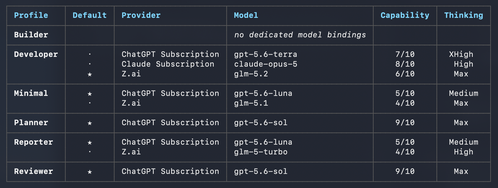

# Model Bindings

A **model binding** is the explicit authorization that connects one agent profile
to one model. It is the single mechanism that turns "which agent" and "which
model" into one routing decision, and it is what `/workflow` uses to assign every
task to the right sub-agent.

Read this page before configuring delegation. Profile concepts and the
delegation lifecycle are in [agents.md](agents.md).

## The Three Concepts

| Concept | What it is | Where it is defined |
| --- | --- | --- |
| **Agent profile** | *Who* does the work: role, instructions, tools, skills | `~/.zencode/agents.json`, edited in `/setup` |
| **Model binding** | *With which model*, at *which capability* and *thinking* level | Per profile, inside the same profile record |
| **Workflow task** | *What* has to be done, with a complexity of 1–10 | Session task graph, created by `/plan`, `/workflow`, or `tasks.create` |

Delegation is the act of matching the three: a task of a given complexity is
assigned to a role-compatible profile, through one of that profile's authorized
bindings.

## Reading the Bindings Table

The bindings table is shown in `/setup`, listing every configured profile with
its authorized bindings:



| Column | Meaning |
| --- | --- |
| **Profile** | The agent profile. `✱` marks the profile selected in the current session. |
| **Default** | `★` is the profile's default binding, `·` is an additional authorized binding. |
| **Provider** | The provider that serves the model (`ChatGPT Subscription`, `Claude Subscription`, `Z.ai`, any OpenAI-compatible endpoint). |
| **Model** | The model authorized for that profile. |
| **Capability** | Routing strength 1–10 of *that profile/model pair*. |
| **Thinking** | Reasoning effort configured for that binding, validated against the model. |

Reading the screenshot row by row:

- **Builder** shows `no dedicated model bindings`. It stays selectable with
  `/agents` and can still be delegated through the legacy fallback, but it is
  **not** a candidate for capability-based delegation routing.
- **Developer** has three bindings across three providers (7/10, 8/10, 6/10).
  The `★` on `glm-5.2` makes it the default, so a sub-agent created without an
  explicit model runs on `glm-5.2` even though stronger bindings exist.
- **Minimal**, **Planner**, **Reporter**, and **Reviewer** each expose the
  bindings appropriate to their role — one for the single-model profiles, two
  for those that can trade cost against strength.

The same profile can therefore appear at very different capabilities: capability
belongs to the **binding**, never to the profile alone.

## Capability vs Complexity

- **Capability (1–10)** is set per binding in setup. It answers: how strong is
  this profile when it runs on this model?
- **Complexity (1–10)** is set per task with `tasks.create`. It answers: how hard
  is this unit of work?

Guideline for both scales:

| Range | Task complexity | Typical binding |
| --- | --- | --- |
| 1–3 | Lookup, single-file edit, mechanical change | Small/fast models |
| 4–6 | Multi-file implementation, focused analysis | Mid-tier models |
| 7–10 | Architecture, cross-system integration, deep reasoning | Frontier models |

## Selection Policy

The coordinator applies these rules **in order**, and never picks by capability
alone:

1. Determine the task type and the tools it requires.
2. Exclude profiles whose role or constraints are incompatible — never assign
   implementation to a read-only `Planner` or `Reviewer`.
3. Do not delegate when the child's effective tool grant cannot perform the work.
4. Among that profile's authorized bindings, choose the **lowest capability that
   is greater than or equal to the task complexity**.
5. If no binding of that profile reaches the complexity, use its highest binding
   and report the capability gap explicitly.

Worked example against the table above — a complexity 6 implementation task:

- `Planner` and `Reviewer` are excluded at step 2 (read-only roles).
- `Builder` is excluded because it has no bindings.
- `Minimal` tops out at 5/10, below the required complexity.
- `Developer` is role-compatible; its lowest qualifying binding is `glm-5.2`
  at 6/10, so that binding wins over the 7/10 and 8/10 options.

The runtime only advises when complexity exceeds the chosen capability; the
coordinator remains responsible for the explicit profile and binding choice.

## What The Model Sees

Profiles with at least one binding that has both a model and a capability are
published in the system prompt as the delegation roster:

```text
Delegatable agent profiles and authorized model bindings (filter by role and constraints first):
- Developer: Developer agent. Implement the user's request with the available tools, ...
  - glm-5.2 (capability 6/10, default)
  - gpt-5.6-terra (capability 7/10)
  - claude-opus-5 (capability 8/10)
```

A binding without a capability is omitted, and a profile whose bindings are all
omitted disappears from the roster entirely — which is why `Builder` in the
screenshot is never routed to automatically. Having a capability is necessary
but not sufficient: the whole roster is also omitted when `agent.create` is not
exposed to the session, or when the session pins a single model.

## Resolution Rules

`agent.create` resolves the profile first, then the binding **inside that
profile only**:

| Profile configuration and request | Result |
| --- | --- |
| Has bindings, no `model` / `modelID` | The profile's default (`★`) binding is used. |
| Has bindings, matching `model` / `modelID` | The explicitly requested authorized binding is used. |
| Has bindings, non-matching `model` / `modelID` | Rejected — the model is not authorized for that profile. |
| No bindings, no explicit model | Legacy fallback: the child inherits the parent session's model, and the profile stays out of the routing roster. |
| No bindings, explicit `model` / `modelID` | Rejected — no authorized binding exists. |
| No profile resolved, explicit `model` / `modelID` | Rejected — a model reference always requires a profile. |

Every rejection happens while the request is prepared, before the task is
claimed. The fallback exists for backward compatibility only; it is not
equivalent to a binding, because it carries no capability and no thinking
selection, and it leaves the profile invisible to capability routing.

## Bindings In `/workflow`

`/workflow <goal>` is where bindings pay off, because every task must be executed
by a sub-agent:

1. The current agent creates the task graph, assigning each task a `complexity`.
2. For each task it picks a role-compatible profile and the lowest qualifying
   binding of that profile.
3. It claims the task atomically with `agent.create(taskID:)`, passing `profile`
   and `model`.
4. It validates the result, and on negative validation records the failure,
   calls `tasks.retry`, and claims a **new** attempt with a new
   `agent.create(taskID:)`.

Mapping the screenshot onto a typical workflow graph: analysis tasks go to
`Reporter`, routine implementation to `Developer` on `glm-5.2` (6/10), delicate
refactors to `Developer` on `claude-opus-5` (8/10). `Planner` and `Reviewer`
remain available for tasks that must *produce* a plan or an intermediate
read-only assessment — in `/workflow` the overall planning and the final review
stay with the coordinator itself, unlike `/plan` and `/review`.

## Configuring Bindings

```text
/setup         # add, edit, or remove bindings per profile
```

Setup asks for, per binding:

- **Model** — the specific provider/model authorized for the profile.
- **Capability (1–10)** — routing strength; setup always stores a value, with `5`
  as the default.
- **Thinking** — reasoning effort, validated against the model's supported
  options.
- **Default** — one binding per profile is marked `★` and used when a caller does
  not choose explicitly.

A binding with no capability at all is only possible in a hand-edited or legacy
`agents.json`; such a binding is silently skipped by delegation routing.

Then inspect the result:

```text
/setup          # add, edit, or remove bindings; the summary shows every profile's authorized bindings
/agents         # switch profile (role, tools, instructions, default binding)
/models         # override the model for the current session only
```

`/models` is independent from `/agents` and never filters the catalog. A manual
model selection overrides the profile default for the **active session**; it
never widens what a delegated sub-agent may run on, because every sub-agent with
a resolved profile is still limited to that profile's authorized bindings.

> **Configure at least one binding for every profile that should receive
> delegated work.** Without it, the profile is invisible to capability routing,
> exactly like `Builder` in the screenshot.
