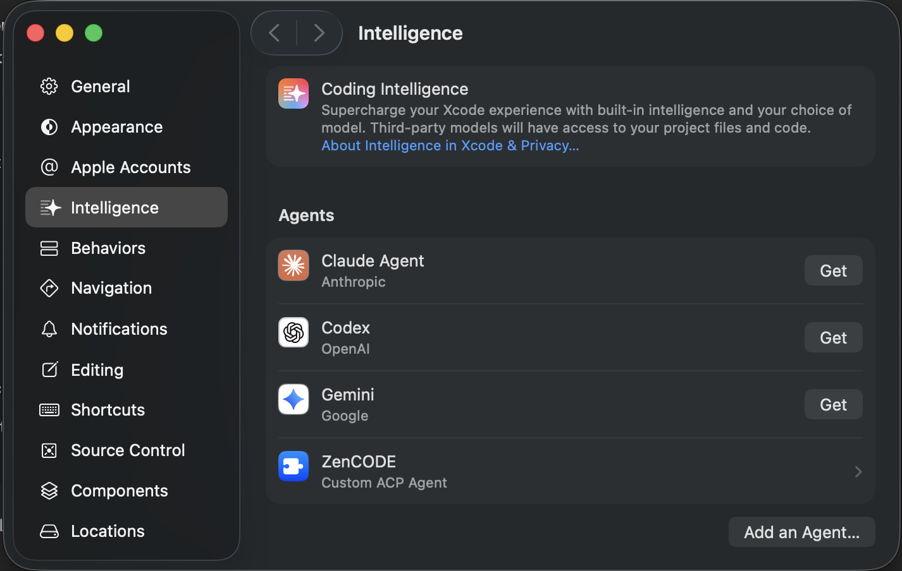
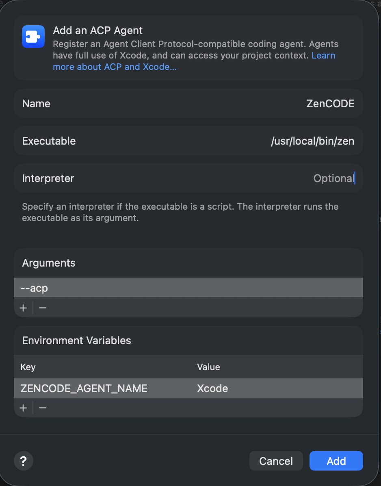

# Xcode 27 ACP setup

Xcode 27 can run `zen` as an ACP stdio coding agent. Use the dedicated `Xcode` agent profile so Xcode sessions get the Xcode-native tool set by default.

## Prerequisites

1. Install `ZenCODE` and run setup at least once:

   ```bash
   zen --setup
   ```

2. Make sure the recommended agents exist. The setup can create `Default`, `Builder`, `Minimal`, `Xcode`, `Planner`, and `Reviewer`.
3. Verify the executable path:

   ```bash
   which zen
   ```

   The default script install usually returns `/usr/local/bin/zen`.

## Add `ZenCODE` in Xcode

1. Open **Xcode 27**.
2. Open **Xcode > Settings…**.
3. Select **Intelligence**.
4. In **Coding Agents**, click **Add an Agent**.



## Configure the agent

In the agent editor, set:

- **Name**: `ZenCODE`
- **Executable**: the full path returned by `which zen`, for example `/usr/local/bin/zen`
- **Arguments**: `--acp`
- **Interpreter**: leave empty

Then add this environment variable:
- **Name**: `ZENCODE_AGENT_NAME`
- **Value**: `Xcode`



Save the agent.

## Recommended configuration

Use this final configuration:

```text
Name: ZenCODE
Executable: /usr/local/bin/zen
Arguments: --acp
Interpreter: <empty>
Environment:
  ZENCODE_AGENT_NAME=Xcode
```

## Troubleshooting

- **Xcode cannot start the agent**: use an absolute executable path, not just `zen`.
- **The wrong agent profile is selected**: check that `ZENCODE_AGENT_NAME` is exactly `Xcode`.
- **Xcode tools are unavailable**: keep Xcode open and approve any MCP/automation prompt shown by Xcode.
- **No model is configured**: run `zen --setup` in Terminal and configure at least one provider/model.
