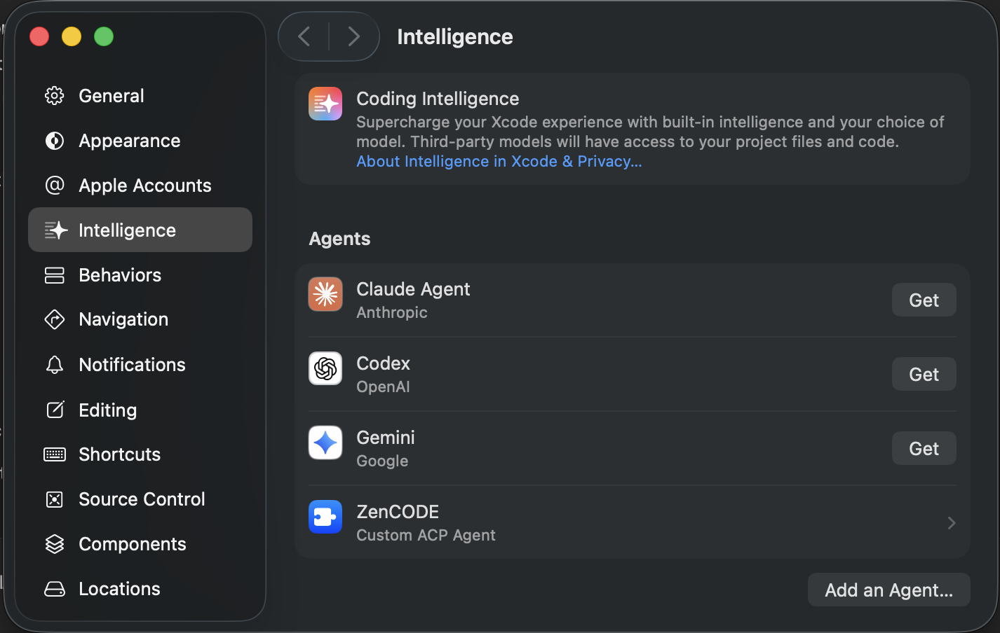
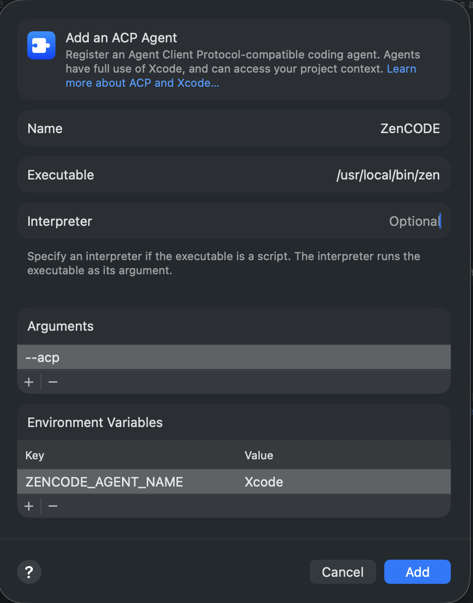

# Xcode ACP setup

Xcode can run `zen` as an ACP stdio coding agent.

## Prerequisites

1. Install `ZenCODE` and run it once. Setup opens automatically when the
   configuration is missing:

   ```bash
   zen
   ```

2. If you want the optional Xcode-native tools, install their macOS-only feature package:

   ```bash
   zen --install-features xcode-tools
   ```

   The Xcode MCP implementation is not part of the `zen` executable or the root
   SwiftPM graph. It runs through the separately installed
   `xcode-tools-feature` process.

3. Make sure the recommended agents exist. The setup can create `Developer`, `Builder`, `Minimal`, `Planner`, `Reviewer`, and `Reporter`.
4. Verify the executable path:

   ```bash
   which zen
   ```

   The default script install usually returns `/usr/local/bin/zen`.

## Add `ZenCODE` in Xcode

1. Open **Xcode**.
2. Open **Xcode > Settings…**.
3. Select **Intelligence**.
4. In **Coding Agents**, click **Add an Agent**.



## Configure the agent

In the agent editor, set:

- **Name**: `ZenCODE`
- **Executable**: the full path returned by `which zen`, for example `/usr/local/bin/zen`
- **Arguments**: `--acp`
- **Interpreter**: leave empty

To pin a specific agent profile, add this environment variable:
- **Name**: `ZENCODE_AGENT_NAME`
- **Value**: `Minimal`



Save the agent.

## Recommended configuration

Use this final configuration:

```text
Name: ZenCODE
Executable: /usr/local/bin/zen
Arguments: --acp
Interpreter: <empty>
Environment:
  ZENCODE_AGENT_NAME=Minimal
```

## Troubleshooting

- **Xcode cannot start the agent**: use an absolute executable path, not just `zen`.
- **Xcode tools are unavailable**: install or update `xcode-tools` with `zen --install-features xcode-tools`, keep Xcode open, enable the package in `/tools`, and approve any MCP/automation prompt shown by Xcode.
- **No model is configured**: run `zen` in Terminal; setup opens automatically. If the TUI is already running, use `/setup`.
- **“This provider requires authentication” in Xcode 27 beta 3**: update ZenCODE, select **Continue with ZenCODE**, then retry the session. This is an Xcode ACP compatibility acknowledgment, not provider authentication.
